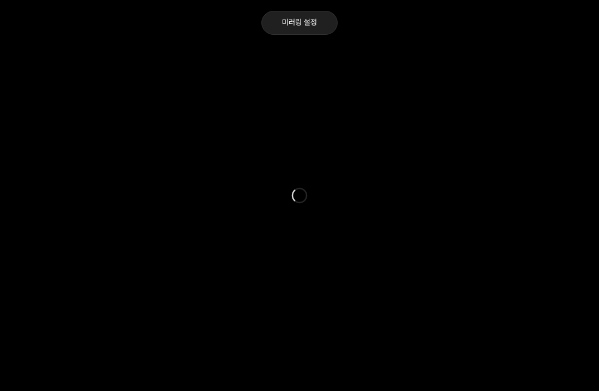

# AirLinker

LonelyScreen 같은 유료 미러링 앱 대신 쓸 수 있는 무료 오픈소스 수신기를 만들고 싶어 시작한 프로젝트입니다. 검은 화면과 작은 설정 버튼만 두고, Apple 기기의 화면을 Windows에서 보는 데 집중합니다.

Windows PC를 iPhone·iPad·Mac의 **화면 미러링 수신기**로 사용하는 데스크톱 앱입니다. 기기에는 별도 앱을 설치하지 않고 제어 센터의 화면 미러링 메뉴에서 연결합니다.

**현재 상태: 개발용 설치 파일 / Apple 실기기 연결 검증 전.** Windows CI에서 네이티브 엔진 컴파일, 앱 패키징, 설치·앱 실행·삭제 테스트를 통과했습니다. 실제 iPhone·iPad·Mac과의 종단 간 미러링은 아직 검증하지 못했습니다.



## 다운로드

[Windows x64 설치 파일 · 약 79MB](https://github.com/sinonmiyaki/AirLinker/releases/download/v0.1.0/AirLinker-Setup-0.1.0-x64.exe)

일반 사용자는 위 EXE만 받으면 됩니다. Release의 `Source-*.zip` 파일은 개발·라이선스용 대응 소스로, 설치에 필요하지 않습니다. 전체 대응 소스가 약 2.2GB인 것이며 앱 설치 파일 크기는 약 79MB입니다.

[Release 및 대응 소스](https://github.com/sinonmiyaki/AirLinker/releases/tag/v0.1.0)

## 구현 내용

- 앱 실행 시 수신 엔진 자동 시작, AirPlay 서비스 등록 완료 후 대기 상태 표시
- 동일 LAN에서 `_airplay._tcp` / `_raop._tcp` 서비스 광고 (UxPlay 내장 mDNS)
- AirPlay 연결·페어링·H.264 수신/디코딩 및 오디오 처리 (UxPlay/GStreamer)
- Windows Direct3D 11 영상 출력을 앱 내부 HWND에 연결
- 검은 배경과 중앙 로딩 표시, 상단 알약 모양 미러링 설정 버튼
- 설정: 수신 이름, 720p/1080p, 최대 30/60fps, 소리, 호환성 모드, 수신, 전체 화면
- 적용 시 필요한 경우 수신기를 재시작, 종료 시 진단 로그 자동 저장
- 시작 실패, 시작 시간 초과, 엔진 종료 처리 및 앱 종료 시 자식 프로세스 정리

해상도·프레임은 기기에 요청하는 상한이며 실제 송출값과 지연은 기기 및 네트워크에 따라 달라집니다. 한 번에 한 기기의 화면을 대상으로 합니다.

## Windows에서 빌드

대상: **Windows 10/11 x64**, Direct3D 11 지원 그래픽 장치.

1. [Python 3.11 Windows x64](https://www.python.org/downloads/windows/)를 설치합니다. `py` 런처도 설치합니다.
2. [MSYS2](https://www.msys2.org/)를 기본 경로 `C:\msys64`에 설치합니다. MSYS2 터미널에서 `pacman -Syu`로 업데이트합니다. 터미널을 다시 열라고 나오면 재실행 후 업데이트를 마칩니다.
3. [Inno Setup 6 또는 7](https://jrsoftware.org/isinfo.php)을 설치합니다.
4. 이 저장소를 Windows에 복사하고 **일반 PowerShell**에서 실행합니다.

```powershell
powershell -ExecutionPolicy Bypass -File .\scripts\build-windows.ps1
```

스크립트는 MSYS2 빌드 의존성을 설치하고, 저장소에 포함된 UxPlay 소스를 컴파일한 뒤, GStreamer 플러그인을 확인하고 데스크톱 앱을 패키징합니다. 최초 실행에는 인터넷과 충분한 디스크 공간이 필요합니다. Python 의존성은 프로젝트의 `.venv`에 설치됩니다.

완료 후 `dist\installer\AirLinker-Setup-0.1.0-x64.exe`를 Windows PC에서 실행하면 설치됩니다. 시작 메뉴·바탕 화면 바로가기, 개인 LAN 방화벽 규칙, 제거 프로그램이 포함됩니다. Python·MSYS2·Inno Setup은 빌드 PC에만 필요합니다. 인증서로 서명한 배포판은 아닙니다.

[Windows Actions](https://github.com/sinonmiyaki/AirLinker/actions/workflows/windows.yml)에서 빌드·테스트·설치/삭제 검증을 실행합니다. 성공한 실행의 Artifacts에서 `AirLinker-Setup-Windows-x64`를 받으세요. 정확한 의존성의 소스는 같은 실행의 `AirLinker-Corresponding-Source`에 제공됩니다. 아티팩트 보관 기간은 30일이며 다운로드에는 GitHub 로그인이 필요합니다.

## 연결하기

1. Windows와 Apple 기기를 같은 LAN에 연결합니다. PC의 유선 LAN과 기기의 Wi-Fi가 같은 공유기에 연결되어 있어도 됩니다.
2. `AirLinker.exe`를 실행합니다. 기본 이름은 **AirLinker Windows**입니다.
3. Windows 방화벽에서 앱의 **개인 네트워크** 수신을 허용합니다.
4. iPhone/iPad: **제어 센터 → 화면 미러링 → AirLinker Windows**.
5. Mac: **제어 센터 → 화면 미러링 → AirLinker Windows**.
6. 중단하려면 기기의 미러링 중단 또는 설정의 수신 끄기를 누릅니다.

상단의 미러링 설정에서 값을 변경하고 적용합니다. 수신 설정이 바뀌면 자동으로 수신을 재시작합니다.

### 방화벽 설정이 필요한 경우

빌드 출력 폴더에서 **관리자 PowerShell**로 아래 스크립트를 명시적으로 실행합니다. 설치 프로그램은 이 규칙을 설치 시 등록하고 제거 시 삭제합니다. 아래 수동 절차는 개발 실행에만 필요합니다.

```powershell
.\configure-firewall.ps1
```

개인 프로필의 로컬 서브넷에만 해당 엔진의 TCP/UDP 35000–35002, UDP 5353을 허용합니다. 규칙을 제거하려면 `-Remove`를 붙입니다. 소스 폴더에서 실행한다면 경로를 지정합니다.

```powershell
.\scripts\configure-firewall.ps1 -EnginePath .\runtime\bin\uxplay.exe
```

### 연결이 안 될 때

- 목록에 없음: 설정에서 수신이 켜져 있는지, Windows 네트워크 프로필이 개인인지, 방화벽이 허용되었는지 확인합니다. 게스트 Wi-Fi/AP isolation/VPN은 기기 간 통신이나 mDNS를 차단할 수 있습니다.
- 검은 화면/디코딩 오류: 수신 중지 후 **호환성 모드**를 켜고 720p/30fps로 다시 시도합니다. 로그에서 누락된 GStreamer 플러그인을 확인합니다.
- 다른 장치에 연결됨: 기기에서 기존 미러링을 중단한 다음 연결합니다.
- 앱 실행 실패: `runtime`을 포함한 전체 폴더를 옮겼는지 확인합니다. 패키지의 DLL과 플러그인은 함께 있어야 합니다.
- 재연결 문제: 기기에서 미러링 중단 → 앱 수신 중지 → 수신 시작 순으로 시도합니다.

## 개발 및 검증

```powershell
.venv\Scripts\python.exe -m airlinker
.venv\Scripts\python.exe -m unittest discover -s tests -v
```

macOS에서도 UI와 프로세스 제어 테스트를 실행할 수 있습니다. Windows 화면 임베딩은 Windows 전용입니다.

```sh
python3 -m venv .venv
.venv/bin/python -m pip install -r requirements.txt
.venv/bin/python -m airlinker --no-autostart
.venv/bin/python -m unittest discover -s tests -v
```

기본 엔진 경로는 `runtime/bin/uxplay.exe`입니다. 개발용으로 `AIRLINKER_ENGINE`에 패치된 엔진의 절대 경로를 설정할 수 있습니다. 원본 UxPlay 바이너리는 이 앱의 상태 이벤트/영상 임베딩 계약을 지원하지 않습니다.

검증된 항목 및 실제 기기로 확인할 항목은 [검증 기록](docs/testing.md), 구조와 변경 내용은 [구현 문서](docs/architecture.md)에 있습니다.

## 범위 및 출처

수신 엔진은 [FDH2/UxPlay](https://github.com/FDH2/UxPlay)의 커밋 `9f3c2bbc658645533fa1057e76c29ec8c947fa0f`를 고정해 포함했습니다. 내장 mDNS를 제공하는 1.74 계열은 upstream에서 실험 기능으로 안내되어 있으므로 네트워크별 발견/재연결 검증이 필요합니다. Bonjour SDK는 이 빌드에 필요하지 않습니다.

Apple TV 앱 등 DRM으로 보호되는 영상은 UxPlay에서 미러링할 수 없습니다. 이 앱은 Apple의 공식 인증 수신기가 아니며, 향후 OS 변경에 따라 호환성 수정이 필요할 수 있습니다. AirPlay 멀티룸 오디오, 원격 기기 조작, 인터넷 너머 연결, 여러 화면 동시 수신은 구현하지 않았습니다. 기본 연결은 PIN 없이 같은 LAN의 기기를 받습니다.

앱과 포함된 UxPlay 수정 소스는 GPL-3.0-or-later입니다. 원저작권 고지와 [LICENSE](LICENSE)를 유지했습니다. Qt/PySide6, GStreamer 및 MSYS2 라이브러리에는 별도 라이선스가 적용됩니다. 빌드 폴더에 설치된 라이브러리 라이선스와 패키지 목록을 복사합니다. 공개 바이너리 배포 전에는 해당 버전 의존성의 대응 소스 제공 의무도 충족해야 합니다.

배포 라이선스 확인 결과는 [THIRD_PARTY_NOTICES.md](THIRD_PARTY_NOTICES.md)에 정리했습니다.
